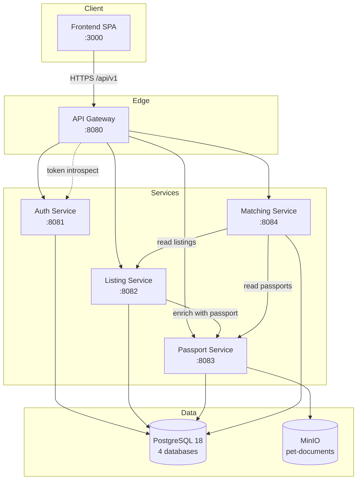

**English** | [Русский](./README.ru.md)

# HvostID

[](https://github.com/hvostid/hvostid/actions/workflows/ci-pr.yml)
[](https://github.com/hvostid/hvostid/actions/workflows/cd-main.yml)
[](./LICENSE)
[](https://openjdk.org/projects/jdk/25/)

Distributed platform for responsible pet sales and transfers. The
platform issues a digital trust passport for each pet and computes an
owner-pet compatibility score so buyers and sellers are matched on more
than just price and breed.

## Contents

- [Architecture](#architecture)
- [Tech Stack](#tech-stack)
- [Quick Start](#quick-start)
- [Production demo](#production-demo)
- [Development](#development)
- [API Documentation](#api-documentation)
- [CI/CD](#cicd)
- [Testing](#testing)
- [Security](#security)
- [Project Structure](#project-structure)
- [Team](#team)
- [License](#license)

## Architecture

Five Spring Boot services behind a Spring Cloud Gateway, plus a React
SPA. PostgreSQL hosts a separate database per service; MinIO stores
passport documents.



Detailed diagrams (sequence, deployment) and design notes live in
[`docs/architecture.md`](./docs/architecture.md).

| Service                                | Port | Database           | Description                                             |
|----------------------------------------|------|--------------------|---------------------------------------------------------|
| [Frontend](./frontend)                 | 3000 | --                 | React SPA, served via Nginx in prod                     |
| [API Gateway](./api-gateway)           | 8080 | --                 | Routing, opaque-token validation, IP-based rate limit   |
| [Auth Service](./auth-service)         | 8081 | `hvostid_auth`     | Registration, login, token introspection, profile/roles |
| [Listing Service](./listing-service)   | 8082 | `hvostid_listing`  | Pet listings CRUD, search, filters                      |
| [Passport Service](./passport-service) | 8083 | `hvostid_passport` | Digital pet passport, documents, trust score            |
| [Matching Service](./matching-service) | 8084 | `hvostid_matching` | Buyer questionnaire, compatibility score                |

## Tech Stack

**Backend**

- Java 25, Spring Boot 4.0, Spring Cloud Gateway
- Gradle multi-module (Kotlin DSL) with version catalog
- PostgreSQL 18, Flyway migrations
- MinIO (S3-compatible)
- Spotless + palantir-java-format, JUnit 5, Testcontainers

**Frontend**

- React 18, Vite, React Router 6
- Tailwind CSS, Axios
- ESLint 9 (flat config) + Prettier

**Infrastructure**

- Docker, Docker Compose
- GitHub Actions (PR CI + main CD to GHCR)
- SonarQube (optional `quality` profile), k6 load tests
- Husky + commitlint + lint-staged

## Quick Start

**Requirements**

- Docker 24+ and Docker Compose v2
- Optional for local IDE work: JDK 25, Node.js 24+

**Bring up the whole platform**

```bash
git clone https://github.com/hvostid/hvostid.git
cd hvostid
cp .env.example .env
docker compose up --build
```

Each backend service builds from source via a multi-stage Dockerfile
(BuildKit cache mount reuses Gradle dependencies between rebuilds), so
no local `./gradlew build` is required first.

Once everything is healthy:

| What                | URL                                          |
|---------------------|----------------------------------------------|
| Frontend            | http://localhost:3000                        |
| API Gateway         | http://localhost:8080                        |
| Aggregated Swagger  | http://localhost:8080/swagger-ui.html        |
| Auth Swagger UI     | http://localhost:8081/swagger-ui.html        |
| Listing Swagger UI  | http://localhost:8082/swagger-ui.html        |
| Passport Swagger UI | http://localhost:8083/swagger-ui.html        |
| Matching Swagger UI | http://localhost:8084/swagger-ui.html        |
| PostgreSQL          | localhost:5432 (4 databases auto-created)    |
| MinIO Console       | http://localhost:9001 (`minioadmin` default) |

**Demo data.** Load a realistic dataset (users, listings, passports,
questionnaires, MinIO photos) with:

```bash
./scripts/seed-all.sh
```

By default this keeps existing Docker volumes and reuses them — the demo
Flyway seed (`db/seed/R__demo_seed.sql`) rewrites rows with id between 1
and 99 on every backend start, so a reseed is non-destructive for ids
you assigned yourself in the UI.

Add `--wipe` to start from a clean slate (`docker compose down -v`,
destroys every Postgres / MinIO volume); the script asks for
confirmation unless `-y` is set or stdin is not a TTY:

```bash
./scripts/seed-all.sh --wipe       # interactive confirm
./scripts/seed-all.sh --wipe -y    # CI-friendly
```

**Reserved id range.** Demo seed owns ids `1..99` in every service
(users, listings, pet_passports, buyer_questionnaire). Anything you
create in the UI on the demo profile will be allocated id ≥ 100 (the
seed bumps the relevant sequences), so seed rewrites do not collide
with your test data.

All demo accounts share the password **`demo1234`**:

| Email | Role(s) |
|-------|---------|
| admin@demo.hvostid | ADMIN |
| moderator@demo.hvostid | MODERATOR |
| seller1@demo.hvostid … seller6@demo.hvostid | SELLER |
| buyer1@demo.hvostid … buyer6@demo.hvostid | BUYER |

Verify after seed:

```bash
curl -s -X POST http://localhost:8080/api/v1/auth/login \
  -H 'Content-Type: application/json' \
  -d '{"email":"buyer1@demo.hvostid","password":"demo1234"}'
# Use accessToken from the response:
curl -s http://localhost:8080/api/v1/listings \
  -H "Authorization: Bearer <accessToken>"
```

Seed runs only when the `demo` Spring profile is active. Production
deploys (`SPRING_PROFILES_ACTIVE=prod`) do not load `db/seed` migrations.
The catalog UI page is still tracked in T30; seeded listings are available
via the API immediately after `./scripts/seed-all.sh`.

## Production demo

Use this profile for a course defense or any “almost production” run:
images are pulled from GHCR (built on `main` by CD), only the SPA and API
Gateway are reachable from the host, logging is at INFO, and Swagger UI is
disabled.

**Requirements:** Docker 24+, Docker Compose v2, and images published to
GHCR (see [CI/CD](#cicd)). If packages are private, log in first.

```bash
cp .env.prod.example .env.prod
# Edit .env.prod: set DB_PASSWORD, MINIO_ACCESS_KEY, MINIO_SECRET_KEY,
# IMAGE_TAG (e.g. latest or a short SHA from main), and GHCR_OWNER.

docker login ghcr.io   # if images are private

docker compose --env-file .env.prod -f docker-compose.prod.yml pull
docker compose --env-file .env.prod -f docker-compose.prod.yml up -d
```

| What     | URL                      |
|----------|--------------------------|
| Frontend | http://localhost         |
| API      | http://localhost:8080    |

The frontend nginx container proxies `/api/` to `api-gateway:8080`, so
the SPA does not need a rebuild per environment. Set
`HVOSTID_CORS_ALLOWED_ORIGINS` to the browser origin of the SPA (default
`http://localhost`) when calling the gateway directly on port 8080.

**What is not exposed on the host:** auth, listing, passport, matching
services, PostgreSQL, and MinIO have no published ports. Verify with
`docker compose -f docker-compose.prod.yml ps` — only `frontend` and
`api-gateway` should list PORTS.

**Demo data.** `./scripts/seed-all.sh` targets the dev compose file and
the `demo` Spring profile. With `SPRING_PROFILES_ACTIVE=prod`, Flyway
seed migrations are not loaded — register a user in the UI and exercise
listings/matching manually, or use the dev stack + seed for a pre-filled
dataset.

**Stop and remove volumes:**

```bash
docker compose --env-file .env.prod -f docker-compose.prod.yml down -v
```

## Development

### Run a single service from your IDE

Bring up infrastructure and the services you are not actively editing,
then run the service under development from the IDE for fast feedback
and full Spring tooling support:

```bash
docker compose up -d postgres minio minio-init listing-service passport-service matching-service api-gateway
./gradlew :auth-service:bootRun
```

### Run the frontend dev server

```bash
cd frontend
npm install
npm run dev
```

Vite serves on http://localhost:3000 and proxies `/api` to the gateway
on `:8080`.

### Build and test the backend

```bash
./gradlew build         # compile + Spotless + tests for every module
./gradlew :auth-service:test
```

### Database migrations

Each service owns its schema in `src/main/resources/db/migration` and
Flyway runs migrations on startup (`spring.flyway.enabled: true`,
`spring.flyway.baseline-on-migrate: true`). JPA is set to `ddl-auto: validate`, so any
divergence between entities and migrations fails the boot. Integration
tests boot a real PostgreSQL via Testcontainers (see
`AbstractPostgresContainerTest`) and apply the same migrations, so the
test suite catches drift before production.

Rules for migrations:

- Naming follows `V<version>__<short_description>.sql` (for example
  `V4__add_user_phone.sql`). Pick the next free version number per
  service; versions are local to each service's history.
- One migration per logical change. Keep migrations small and reviewable.
- Never edit a migration after it has been merged to `main`. Flyway
  validates the checksum on startup, and a changed file will fail every
  environment that already applied it. To fix a mistake, add a new
  migration that reverts or amends the previous one.
- Never delete a migration that has been merged. If a feature is
  reverted, add a forward migration that drops the new objects.
- Keep DDL and data changes idempotent where the database engine allows
  (`CREATE INDEX IF NOT EXISTS`, `ALTER TABLE ... ADD COLUMN IF NOT
  EXISTS`) to make re-runs in dev safe.
- Update the matching JPA entity in the same PR as the migration so
  `ddl-auto: validate` stays green.
- Handwritten `repair` operations are only acceptable for local
  developer databases and never for shared environments.

### Pre-commit hooks

After cloning, install hook tooling once:

```bash
npm install                  # commitlint + husky + lint-staged at the repo root
npm install --prefix frontend  # eslint + prettier + lint-staged for the pre-commit hook
```

The hooks then validate every commit:

- `commit-msg` -- enforces Conventional Commits with a task id (see
  [`commitlint.config.js`](./commitlint.config.js)).
- `pre-commit` -- runs `lint-staged` at the repo root (applies Spotless
  to staged Java files via `./gradlew spotlessApply`) and inside
  `frontend/` (applies `eslint --fix` and `prettier --write` to staged
  JS/JSX/CSS/HTML/JSON files).

`./gradlew spotlessCheck` still runs as part of `check` (so `build` and
CI) as the backstop for files the hook did not touch. Use `./gradlew
spotlessApply` to fix the rest of the tree.

See [CONTRIBUTING.md](./CONTRIBUTING.md) for the full workflow,
commit-message rules, code-style decisions, and review checklist.

## API Documentation

- **Aggregated Swagger UI** -- the API Gateway hosts a single
  `/swagger-ui.html` (http://localhost:8080/swagger-ui.html in local
  dev) with a "Select a definition" dropdown that lists every
  downstream service. Each entry is fetched from
  `/v3/api-docs/<service>` on the gateway, which proxies to the
  service's own spec endpoint -- no CORS, no manual port-switching.
- **Per-service Swagger UI** -- still available on the per-port URLs
  in the [Quick Start](#quick-start) table above, handy when you are
  running a single service from your IDE. The Auth Service spec uses
  Bearer-token auth; the other services use the `X-User-Id` header
  scheme that the gateway populates after token introspection.
- **OpenAPI JSON** -- served at `/v3/api-docs` on each service and at
  `/v3/api-docs/<service>` on the gateway. CI uploads every spec as
  the `openapi-specs` artifact on each PR build (see
  [`ci-pr.yml`](./.github/workflows/ci-pr.yml)).
- **Postman collection** -- tracked in T36 (TODO).

## CI/CD

Three GitHub Actions workflows live in [`.github/workflows`](./.github/workflows):

- [`ci-pr.yml`](./.github/workflows/ci-pr.yml) runs on every pull
  request: `./gradlew check` (Spotless, JUnit, JaCoCo), optional
  SonarQube scan, backend and frontend Docker builds.
- [`cd-main.yml`](./.github/workflows/cd-main.yml) runs on merges to
  `main`: rebuilds and pushes per-service images to GitHub Container
  Registry (parallel matrix), scans every image with Trivy (SARIF
  results visible in the Security tab when GHAS is enabled, JSON
  reports reimported into DefectDojo when configured), then runs a
  smoke test that brings up the full Compose stack and waits for
  every `/actuator/health` to return 200.
- [`security-scan.yml`](./.github/workflows/security-scan.yml) runs
  daily and on dependency-declaration changes merged to `main`:
  `./gradlew dependencyCheckAggregate` produces an OWASP Dependency
  Check report; SARIF goes to GitHub Code Scanning and the XML
  report is reimported into DefectDojo when configured.

Image tags follow `ghcr.io/hvostid/hvostid-<service>:<short-sha>` plus
`latest`.

## Testing

- **Unit tests** -- JUnit 5 + Mockito + Spring `WebMvcTest`. Run with
  `./gradlew test` or `./gradlew :auth-service:test`.
- **Integration tests** -- Testcontainers boots a PostgreSQL container
  per test class via the shared
  `common.testfixtures.AbstractPostgresContainerTest`. Tracked in T22.
- **Coverage** -- JaCoCo XML reports at
  `<module>/build/reports/jacoco/test/jacocoTestReport.xml`, picked up
  by SonarQube.
- **Load tests** -- k6 scripts in [`k6/`](./k6) (catalog search, listing
  create, match score). Tracked in T24.

```bash
# Single load test, against a running stack
k6 run k6/search-listings.js
```

## Security

See [SECURITY.md](./SECURITY.md) for the full vulnerability response
process. A brief overview of the automated security layers:

- **Dependabot** -- automatically opens PRs for outdated dependencies
  across Gradle, npm, Docker, and GitHub Actions ecosystems (weekly
  schedule, patch/minor updates are grouped).
- **OWASP Dependency Check** -- runs daily on a schedule and on
  dependency-declaration changes merged to `main` via
  `./gradlew dependencyCheckAggregate`. Fails the build on CVSS >= 9.0
  (critical). Known false positives are suppressed in
  [`dependency-check-suppressions.xml`](./dependency-check-suppressions.xml).
- **Trivy** -- scans every Docker image pushed to GHCR after each
  merge to `main`. Fails on CRITICAL severity.
- **DefectDojo** (optional) -- when `DEFECTDOJO_URL` and
  `DEFECTDOJO_TOKEN` secrets are configured, Trivy and OWASP
  Dependency Check results are reimported into a self-hosted
  DefectDojo instance for deduplication, triage and SLA tracking.

SARIF reports from both scanners are uploaded to the
**Security -> Code scanning** tab when GitHub Advanced Security is
enabled (automatic for public repositories).

## Project Structure

```
hvostid/
  .github/
    dependabot.yml         -- automatic dependency updates
    workflows/             -- CI (PR) and CD (main) pipelines
    CODEOWNERS
    pull_request_template.md
  api-gateway/             -- Spring Cloud Gateway
  auth-service/            -- registration, login, token introspection
  listing-service/         -- pet listings
  passport-service/        -- pet passports + MinIO documents
  matching-service/        -- buyer questionnaire + compatibility
  common/                  -- shared DTOs, security, test fixtures
  frontend/                -- React SPA (Vite + Tailwind)
    src/
      api/                 -- axios client
      context/             -- AuthContext
      components/
      pages/
  k6/                      -- load tests
  docker/                  -- compose helpers (db init, etc.)
  docs/                    -- architecture and design notes
  postman/                 -- API collection (T36, TODO)
  build.gradle.kts
  settings.gradle.kts
  gradle/libs.versions.toml
  dependency-check-suppressions.xml
  docker-compose.yml
  Dockerfile               -- shared multi-stage backend Dockerfile
  SECURITY.md
```

## Team

| # | Role                | Backend                 | Frontend                                                  |
|---|---------------------|-------------------------|-----------------------------------------------------------|
| 1 | Tech Lead / DevOps  | Gateway, CI/CD, Docker  | --                                                        |
| 2 | Auth/Profile        | Auth Service            | React scaffold, auth pages, seller pages, moderator panel |
| 3 | Catalog/Search      | Listing Service         | Catalog page, listing detail                              |
| 4 | Passport/Moderation | Passport Service        | Profile, matching result                                  |
| 5 | Matching + QA       | Matching Service, tests | --                                                        |

Reviewers are assigned automatically via
[`.github/CODEOWNERS`](./.github/CODEOWNERS).

## License

[MIT](./LICENSE)
