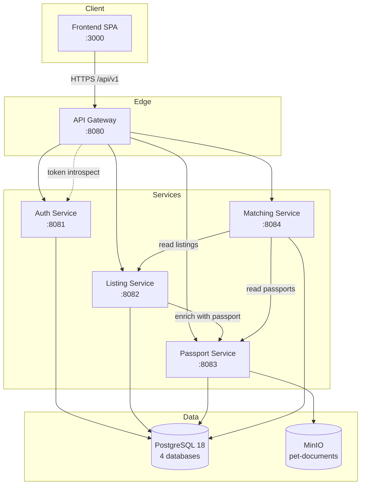

[English](./README.md) | **Русский**

# HvostID

[](https://github.com/hvostid/hvostid/actions/workflows/ci-pr.yml)
[](https://github.com/hvostid/hvostid/actions/workflows/cd-main.yml)
[](./LICENSE)
[](https://openjdk.org/projects/jdk/25/)

Распределённая платформа для ответственной продажи и передачи
домашних животных. Платформа выпускает цифровой паспорт доверия для
каждого питомца и рассчитывает оценку совместимости владельца и
питомца, чтобы покупатели и продавцы подбирались не только по цене и
породе.

## Содержание

- [Архитектура](#архитектура)
- [Технологический стек](#технологический-стек)
- [Quick Start](#quick-start)
- [Разработка](#разработка)
- [Документация API](#документация-api)
- [CI/CD](#cicd)
- [Тестирование](#тестирование)
- [Безопасность](#безопасность)
- [Структура проекта](#структура-проекта)
- [Команда](#команда)
- [Лицензия](#лицензия)

## Архитектура

Пять Spring Boot сервисов за Spring Cloud Gateway плюс React SPA.
PostgreSQL хранит отдельную базу данных на каждый сервис; MinIO
хранит документы паспортов.



Подробные диаграммы (последовательности, развёртывания) и проектные
заметки находятся в
[`docs/architecture.ru.md`](./docs/architecture.ru.md).

| Сервис                                 | Порт | База данных        | Описание                                                  |
|----------------------------------------|------|--------------------|-----------------------------------------------------------|
| [Frontend](./frontend)                 | 3000 | --                 | React SPA, в проде раздаётся через Nginx                  |
| [API Gateway](./api-gateway)           | 8080 | --                 | Маршрутизация, валидация opaque-токенов, rate limit по IP |
| [Auth Service](./auth-service)         | 8081 | `hvostid_auth`     | Регистрация, логин, интроспекция токенов, профиль, роли   |
| [Listing Service](./listing-service)   | 8082 | `hvostid_listing`  | CRUD объявлений о питомцах, поиск, фильтры                |
| [Passport Service](./passport-service) | 8083 | `hvostid_passport` | Цифровой паспорт питомца, документы, оценка доверия       |
| [Matching Service](./matching-service) | 8084 | `hvostid_matching` | Анкета покупателя, оценка совместимости                   |

## Технологический стек

**Бэкенд**

- Java 25, Spring Boot 4.0, Spring Cloud Gateway
- Gradle multi-module (Kotlin DSL) с version catalog
- PostgreSQL 18, миграции Flyway
- MinIO (S3-совместимый)
- Spotless + palantir-java-format, JUnit 5, Testcontainers

**Фронтенд**

- React 18, Vite, React Router 6
- Tailwind CSS, Axios
- ESLint 9 (flat config) + Prettier

**Инфраструктура**

- Docker, Docker Compose
- GitHub Actions (CI на PR + CD из main в GHCR)
- SonarQube (опциональный профиль `quality`), нагрузочные тесты k6
- Husky + commitlint + lint-staged

## Quick Start

**Требования**

- Docker 24+ и Docker Compose v2
- Опционально для локальной разработки в IDE: JDK 25, Node.js 24+

**Запустить всю платформу**

```bash
git clone https://github.com/hvostid/hvostid.git
cd hvostid
cp .env.example .env
docker compose up --build
```

Каждый бэкенд-сервис собирается из исходников через многоступенчатый
Dockerfile (BuildKit cache mount переиспользует Gradle-зависимости
между пересборками), поэтому локальный `./gradlew build` не нужен.

Когда всё стало healthy:

| Что                 | URL                                                    |
|---------------------|--------------------------------------------------------|
| Frontend            | http://localhost:3000                                  |
| API Gateway         | http://localhost:8080                                  |
| Aggregated Swagger  | http://localhost:8080/swagger-ui.html                  |
| Auth Swagger UI     | http://localhost:8081/swagger-ui.html                  |
| Listing Swagger UI  | http://localhost:8082/swagger-ui.html                  |
| Passport Swagger UI | http://localhost:8083/swagger-ui.html                  |
| Matching Swagger UI | http://localhost:8084/swagger-ui.html                  |
| PostgreSQL          | localhost:5432 (4 базы данных создаются автоматически) |
| MinIO Console       | http://localhost:9001 (`minioadmin` по умолчанию)      |

**Демо-данные.** Загрузите реалистичный набор данных (пользователи,
объявления, паспорта, анкеты, фото в MinIO):

```bash
./scripts/seed-all.sh
```

По умолчанию скрипт сохраняет существующие Docker volumes — demo-сид
(`db/seed/R__demo_seed.sql`) на каждом старте перезаписывает строки с id
от 1 до 99, поэтому повторный seed не разрушает данные, которые вы
создали в UI с id >= 100.

Флаг `--wipe` начинает с чистого листа (`docker compose down -v`,
сносит все Postgres / MinIO volumes); скрипт запрашивает подтверждение,
если только не передан `-y` или stdin не является TTY:

```bash
./scripts/seed-all.sh --wipe       # с интерактивным подтверждением
./scripts/seed-all.sh --wipe -y    # для CI
```

**Зарезервированный диапазон ID.** Демо-сид владеет id `1..99` во всех
сервисах (users, listings, pet_passports, buyer_questionnaire). Всё, что
вы создаёте через UI на демо-профиле, получит id >= 100 (seed после
вставок поднимает sequence'ы), и повторный seed не задевает ваши
тестовые данные.

Пароль для всех demo-аккаунтов: **`demo1234`**.

| Email | Роль(и) |
|-------|---------|
| admin@demo.hvostid | ADMIN |
| moderator@demo.hvostid | MODERATOR |
| seller1@demo.hvostid … seller6@demo.hvostid | SELLER |
| buyer1@demo.hvostid … buyer6@demo.hvostid | BUYER |

Проверка после seed:

```bash
curl -s -X POST http://localhost:8080/api/v1/auth/login \
  -H 'Content-Type: application/json' \
  -d '{"email":"buyer1@demo.hvostid","password":"demo1234"}'
# Подставьте accessToken из ответа:
curl -s http://localhost:8080/api/v1/listings \
  -H "Authorization: Bearer <accessToken>"
```

Seed загружается только при профиле `demo`. В production
(`SPRING_PROFILES_ACTIVE=prod`) миграции из `db/seed` не подключаются.
Страница каталога на фронтенде — в T30; объявления доступны через API
сразу после `./scripts/seed-all.sh`.

## Разработка

### Запуск отдельного сервиса из IDE

Поднимите инфраструктуру и сервисы, которые сейчас не редактируете, а
сервис под разработкой запускайте из IDE для быстрого фидбэка и полной
поддержки Spring-инструментов:

```bash
docker compose up -d postgres minio minio-init listing-service passport-service matching-service api-gateway
./gradlew :auth-service:bootRun
```

### Запуск dev-сервера фронтенда

```bash
cd frontend
npm install
npm run dev
```

Vite работает на http://localhost:3000 и проксирует `/api` на gateway
(`:8080`).

### Сборка и тесты бэкенда

```bash
./gradlew build         # компиляция + Spotless + тесты по всем модулям
./gradlew :auth-service:test
```

### Миграции БД

Каждый сервис владеет своей схемой в `src/main/resources/db/migration`,
и Flyway применяет миграции при старте (`spring.flyway.enabled: true`,
`spring.flyway.baseline-on-migrate: true`). JPA настроена на `ddl-auto: validate`,
поэтому любое расхождение между сущностями и миграциями приводит к
падению при загрузке. Интеграционные тесты поднимают настоящий
PostgreSQL через Testcontainers (см. `AbstractPostgresContainerTest`)
и применяют те же миграции -- так дрейф ловится до production.

Правила работы с миграциями:

- Имена файлов: `V<version>__<short_description>.sql` (например,
  `V4__add_user_phone.sql`). Берите следующий свободный номер версии
  внутри сервиса; история версий локальна для каждого сервиса.
- Одна миграция -- одно логическое изменение. Держите миграции
  маленькими и удобными для ревью.
- Никогда не редактируйте миграцию после её мержа в `main`. Flyway
  проверяет checksum при старте, и изменённый файл уронит каждое
  окружение, которое его уже применило. Чтобы исправить ошибку,
  добавляйте новую миграцию, которая откатывает или дополняет старую.
- Никогда не удаляйте уже смерженную миграцию. Если фича откатывается,
  пишите forward-миграцию, которая удаляет созданные объекты.
- Делайте DDL и data-изменения идемпотентными там, где это поддерживает
  СУБД (`CREATE INDEX IF NOT EXISTS`, `ALTER TABLE ... ADD COLUMN IF NOT
  EXISTS`), чтобы повторный прогон в dev был безопасным.
- Обновляйте JPA-сущность в том же PR, что и миграцию, чтобы
  `ddl-auto: validate` оставался зелёным.
- Ручные `repair` допустимы только для локальной БД разработчика и
  никогда для общих окружений.

### Pre-commit hooks

После клонирования один раз установите тулинг для хуков:

```bash
npm install                  # commitlint + husky + lint-staged на корне репозитория
npm install --prefix frontend  # eslint + prettier + lint-staged для pre-commit hook
```

После этого хуки валидируют каждый коммит:

- `commit-msg` -- проверяет соответствие сообщения Conventional Commits
  с task id (см. [`commitlint.config.js`](./commitlint.config.js)).
- `pre-commit` -- запускает `lint-staged` на корне (применяет Spotless
  к staged Java-файлам через `./gradlew spotlessApply`) и внутри
  `frontend/` (применяет `eslint --fix` и `prettier --write` к
  staged-файлам JS/JSX/CSS/HTML/JSON).

`./gradlew spotlessCheck` по-прежнему входит в `check` (то есть и в
`build`, и в CI) как страховка для файлов, не затронутых хуком.
`./gradlew spotlessApply` чинит остальное дерево.

См. [CONTRIBUTING.ru.md](./CONTRIBUTING.ru.md) -- полный workflow,
правила сообщений коммитов, решения по code style и чек-лист ревью.

## Документация API

- **Aggregated Swagger UI** -- API Gateway раздаёт единый
  `/swagger-ui.html` (в локалке http://localhost:8080/swagger-ui.html)
  с дропдауном "Select a definition", куда заведены все сервисы.
  Каждая запись тянется с `/v3/api-docs/<service>` на gateway, который
  проксирует к спеке самого сервиса -- без CORS и ручного переключения
  портов.
- **Per-service Swagger UI** -- остаётся доступным по портовым URL из
  таблицы [Quick Start](#quick-start) выше, удобно когда поднимаешь
  один сервис из IDE. Auth Service использует Bearer-токен; остальные
  -- security scheme с заголовком `X-User-Id`, который gateway
  добавляет автоматически после успешной интроспекции токена.
- **OpenAPI JSON** -- доступен по `/v3/api-docs` на каждом сервисе и по
  `/v3/api-docs/<service>` на gateway. CI прикрепляет все спеки как
  артефакт `openapi-specs` к каждому PR-сборке (см.
  [`ci-pr.yml`](./.github/workflows/ci-pr.yml)).
- **Postman-коллекция** -- отслеживается в T36 (TODO).

## CI/CD

Три workflow GitHub Actions лежат в [`.github/workflows`](./.github/workflows):

- [`ci-pr.yml`](./.github/workflows/ci-pr.yml) запускается на каждый
  pull request: `./gradlew check` (Spotless, JUnit, JaCoCo),
  опциональный сканер SonarQube, сборка Docker-образов бэкенда и
  фронтенда.
- [`cd-main.yml`](./.github/workflows/cd-main.yml) запускается при
  мерже в `main`: пересобирает и пушит образы каждого сервиса в
  GitHub Container Registry (параллельная matrix), сканирует каждый
  образ через Trivy (результаты SARIF видны во вкладке Security при
  включённом GHAS, JSON-отчёты загружаются в DefectDojo, если он
  настроен), затем запускает smoke-тест, поднимающий весь стек через
  Compose и ожидающий 200 от `/actuator/health` каждого сервиса.
- [`security-scan.yml`](./.github/workflows/security-scan.yml)
  запускается ежедневно и при изменении файлов зависимостей в `main`:
  `./gradlew dependencyCheckAggregate` строит отчёт OWASP Dependency
  Check; SARIF уезжает в GitHub Code Scanning, XML-отчёт
  переотправляется в DefectDojo, если он настроен.

Теги образов: `ghcr.io/hvostid/hvostid-<service>:<short-sha>` и
`latest`.

## Тестирование

- **Unit-тесты** -- JUnit 5 + Mockito + Spring `WebMvcTest`. Запуск
  через `./gradlew test` или `./gradlew :auth-service:test`.
- **Интеграционные тесты** -- Testcontainers поднимает контейнер
  PostgreSQL на тестовый класс через общий
  `common.testfixtures.AbstractPostgresContainerTest`. Отслеживается в
  T22.
- **Покрытие** -- JaCoCo XML-отчёты в
  `<module>/build/reports/jacoco/test/jacocoTestReport.xml`,
  собираются SonarQube.
- **Нагрузочные тесты** -- k6 скрипты в [`k6/`](./k6) (поиск каталога,
  создание объявления, оценка совместимости). Отслеживается в T24.

```bash
# Один нагрузочный тест против запущенного стека
k6 run k6/search-listings.js
```

## Безопасность

См. [SECURITY.ru.md](./SECURITY.ru.md) -- полный процесс реагирования
на уязвимости. Краткий обзор автоматических уровней защиты:

- **Dependabot** -- автоматически открывает PR на обновление устаревших
  зависимостей для экосистем Gradle, npm, Docker и GitHub Actions
  (еженедельное расписание, patch/minor обновления группируются).
- **OWASP Dependency Check** -- запускается ежедневно по расписанию и
  при изменении файлов зависимостей в `main` через
  `./gradlew dependencyCheckAggregate`. Завершает сборку с ошибкой при
  CVSS >= 9.0 (critical). Известные false positives подавляются через
  [`dependency-check-suppressions.xml`](./dependency-check-suppressions.xml).
- **Trivy** -- сканирует каждый Docker-образ, отправленный в GHCR
  после каждого мержа в `main`. Завершает с ошибкой при CRITICAL
  severity.
- **DefectDojo** (опционально) -- если в секретах репозитория заданы
  `DEFECTDOJO_URL` и `DEFECTDOJO_TOKEN`, результаты Trivy и OWASP
  Dependency Check переотправляются в self-hosted инстанс DefectDojo
  для дедупликации, триажа и отслеживания SLA.

SARIF-отчёты от обоих сканеров загружаются во вкладку
**Security -> Code scanning**, если включён GitHub Advanced Security
(автоматически для публичных репозиториев).

## Структура проекта

```
hvostid/
  .github/
    dependabot.yml         -- автоматические обновления зависимостей
    workflows/             -- CI (PR) и CD (main) пайплайны
    CODEOWNERS
    pull_request_template.md
  api-gateway/             -- Spring Cloud Gateway
  auth-service/            -- регистрация, логин, интроспекция токенов
  listing-service/         -- объявления о питомцах
  passport-service/        -- паспорта питомцев + документы в MinIO
  matching-service/        -- анкета покупателя + совместимость
  common/                  -- общие DTO, security, тестовые фикстуры
  frontend/                -- React SPA (Vite + Tailwind)
    src/
      api/                 -- axios-клиент
      context/             -- AuthContext
      components/
      pages/
  k6/                      -- нагрузочные тесты
  docker/                  -- помощники для compose (init БД и т.п.)
  docs/                    -- архитектура и проектные заметки
  postman/                 -- API-коллекция (T36, TODO)
  build.gradle.kts
  settings.gradle.kts
  gradle/libs.versions.toml
  dependency-check-suppressions.xml
  docker-compose.yml
  Dockerfile               -- общий многоступенчатый Dockerfile бэкенда
  SECURITY.md
  SECURITY.ru.md
```

## Команда

| # | Роль                | Бэкенд                  | Фронтенд                                                          |
|---|---------------------|-------------------------|-------------------------------------------------------------------|
| 1 | Tech Lead / DevOps  | Gateway, CI/CD, Docker  | --                                                                |
| 2 | Auth/Profile        | Auth Service            | React-каркас, страницы auth, страницы продавца, панель модератора |
| 3 | Catalog/Search      | Listing Service         | Каталог, страница объявления                                      |
| 4 | Passport/Moderation | Passport Service        | Профиль, результат подбора                                        |
| 5 | Matching + QA       | Matching Service, тесты | --                                                                |

Ревьюеры назначаются автоматически через
[`.github/CODEOWNERS`](./.github/CODEOWNERS).

## Лицензия

[MIT](./LICENSE)
