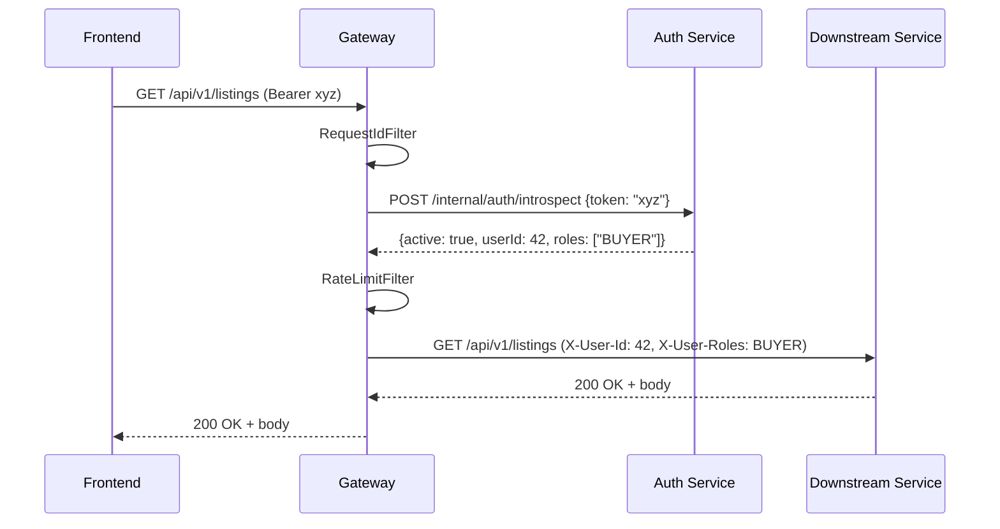

# Architecture

This document expands on the high-level diagram in the
[root README](../README.md#architecture). It covers service
responsibilities, the request lifecycle, persistence boundaries, and
the cross-service contracts that hold the platform together.

## Contents

- [Services](#services)
- [Request lifecycle](#request-lifecycle)
- [Authentication and authorization](#authentication-and-authorization)
- [Persistence](#persistence)
- [Cross-service calls](#cross-service-calls)
- [Observability](#observability)
- [Deployment topology](#deployment-topology)

## Services

| Service          | Owns                                                            | Talks to                       |
|------------------|-----------------------------------------------------------------|--------------------------------|
| API Gateway      | Routing, token introspection, rate limiting, request id         | Auth (introspection)           |
| Auth Service     | Users, sessions, opaque access/refresh tokens, profile, roles   | --                             |
| Listing Service  | Pet listings (CRUD, search)                                     | Passport (read-only enrich)    |
| Passport Service | Pet passports, document uploads, trust score                    | MinIO                          |
| Matching Service | Buyer questionnaire, compatibility score                        | Listing, Passport (read-only)  |

`common/` is a shared Java module: DTOs (`IntrospectRequest`,
`IntrospectResponse`, `ErrorResponse`), the `SecurityHeaders` and
`UserRole` constants, OpenAPI security-scheme helpers, and a
Testcontainers PostgreSQL fixture under `testFixtures`.

## Request lifecycle

Every browser request goes to the Gateway on `:8080`. The Gateway is a
Spring Cloud Gateway server-MVC instance that runs three filters in
order:

1. **`RequestIdFilter`** -- attaches an `X-Request-Id` header (generated
   if absent) and binds it to the SLF4J MDC so all log lines for the
   request share an id.
2. **`TokenIntrospectionFilter`** -- skipped for `publicPaths`
   (`/api/v1/auth/login`, `/api/v1/auth/register`, `/actuator/**`). For
   every other path it extracts the `Bearer` token, calls Auth Service
   `POST /internal/auth/introspect`, and on success injects two headers
   into the upstream request:
    - `X-User-Id` -- numeric user id
    - `X-User-Roles` -- comma-separated role list
3. **`RateLimitFilter`** -- token-bucket per client IP
   (`replenish-rate=20`, `burst-capacity=40`).

Downstream services trust those two headers because the introspection
endpoint is internal-only (not routed through the Gateway). They
construct a Spring Security `GatewayPreAuthentication` from the
headers, which is what `@PreAuthorize` checks against.

## Authentication and authorization

- **Tokens are opaque.** The Auth Service issues random strings and
  stores them in `sessions` keyed by user id. There is no JWT, no
  signing key, and no client-side token verification -- every request
  introspects.
- **Two-token flow.** Login returns an access token (default 30m TTL)
  and a refresh token (default 7d TTL). The refresh endpoint accepts a
  refresh token and returns a new pair, rotating the old refresh token
  out.
- **Roles** live in the `user_roles` table and are returned by
  introspection. Downstream services check them with Spring Security
  `@PreAuthorize("hasRole('SELLER')")`.
- **Public paths** are configured in
  [`api-gateway/src/main/resources/application.yml`](../api-gateway/src/main/resources/application.yml)
  under `hvostid.auth.public-paths`. Only login, register, and actuator
  health endpoints currently bypass introspection.

## Persistence

Every backend service owns its own PostgreSQL schema. There is no
cross-service SQL -- if Listing needs passport data, it makes an HTTP
call. The shared PostgreSQL instance creates four databases on first
startup via [`docker/init-databases.sql`](../docker/init-databases.sql):

| Database           | Owner            | Notable tables                       |
|--------------------|------------------|--------------------------------------|
| `hvostid_auth`     | Auth Service     | `users`, `sessions`, `user_roles`    |
| `hvostid_listing`  | Listing Service  | `listings`                           |
| `hvostid_passport` | Passport Service | (schema created via Flyway, T19/T20) |
| `hvostid_matching` | Matching Service | `buyer_questionnaires`               |

Migrations live next to the service that owns them, in
`<service>/src/main/resources/db/migration`, and Flyway runs them on
boot. JPA is configured with `ddl-auto: validate`, so any drift
between entities and the schema fails the application start.

MinIO holds passport documents in the `pet-documents` bucket
(auto-created by the `minio-init` Compose service). The Passport
Service is the only service that talks to MinIO.

## Cross-service calls

Service-to-service calls use plain HTTP through `RestClient`, with the
target host injected from the environment so the same code works
locally and in Compose.

| From            | To       | Purpose                                 | Property                       |
|-----------------|----------|-----------------------------------------|--------------------------------|
| Gateway         | Auth     | Token introspection                     | `hvostid.auth.introspect-url`  |
| Listing         | Passport | Enrich a listing with passport data     | `hvostid.passport-service.url` |
| Matching        | Listing  | Read listings for compatibility scoring | `hvostid.listing-service.url`  |
| Matching        | Passport | Read passports for compatibility scoring| `hvostid.passport-service.url` |

There is no service mesh and no circuit breaker; failures surface as
plain HTTP errors and are mapped to `ErrorResponse` by each service's
`GlobalExceptionHandler`.

## Observability

- **Health.** Each service exposes `/actuator/health` (used by Compose
  healthchecks and the CD smoke test).
- **Logs.** SLF4J + Logback at `INFO` root and `DEBUG` for
  `ru.hvostid.*`. Request id propagates via MDC.
- **Metrics.** `actuator/info` is exposed; Prometheus scrape is not
  wired up yet.
- **Code quality.** SonarQube via the `quality` Compose profile; CI
  runs `./gradlew sonar` only when `SONAR_TOKEN` is configured as a
  GitHub Actions secret.
- **Load.** k6 scripts under [`k6/`](../k6) drive synthetic load
  against the gateway. (T24)

## Deployment topology

In production the entire stack runs as Docker images. The CD workflow
([`.github/workflows/cd-main.yml`](../.github/workflows/cd-main.yml))
publishes per-service images to GitHub Container Registry under
`ghcr.io/hvostid/hvostid-<service>:<short-sha>` (and `:latest`).

Locally, the same images run via
[`docker-compose.yml`](../docker-compose.yml). The compose stack
contains:

- 1 Postgres container (4 logical databases)
- 1 MinIO container + 1 init container that creates the bucket
- 5 Spring Boot services
- 1 Nginx-served frontend
- (optional, `quality` profile) 1 SonarQube container

Compose `depends_on` with `condition: service_healthy` enforces the
boot order: Postgres and MinIO come up first, then Auth, then the rest.
