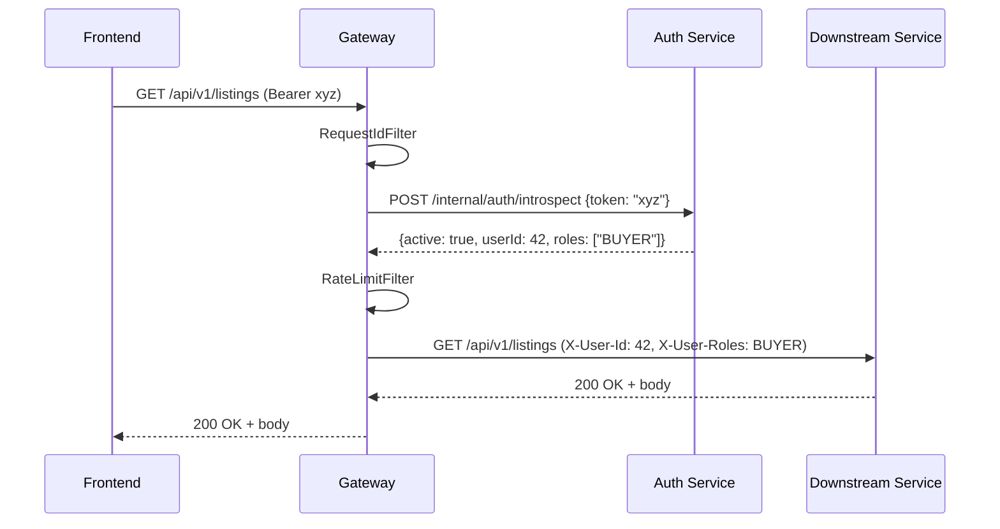

[English](./architecture.md) | **Русский**

# Архитектура

Этот документ расширяет высокоуровневую диаграмму из
[корневого README](../README.ru.md#архитектура). Здесь описаны зоны
ответственности сервисов, жизненный цикл запроса, границы хранилищ и
межсервисные контракты, которые держат платформу вместе.

## Содержание

- [Сервисы](#сервисы)
- [Жизненный цикл запроса](#жизненный-цикл-запроса)
- [Аутентификация и авторизация](#аутентификация-и-авторизация)
- [Хранилища](#хранилища)
- [Межсервисные вызовы](#межсервисные-вызовы)
- [Observability](#observability)
- [Топология развёртывания](#топология-развёртывания)

## Сервисы

| Сервис           | Владеет                                                          | Вызывает                       |
|------------------|------------------------------------------------------------------|--------------------------------|
| API Gateway      | Маршрутизация, интроспекция токенов, rate limiting, request id   | Auth (introspection)           |
| Auth Service     | Пользователи, сессии, opaque access/refresh токены, профиль, роли| --                             |
| Listing Service  | Объявления о питомцах (CRUD, поиск)                              | Passport (read-only enrich)    |
| Passport Service | Паспорта питомцев, загрузка документов, оценка доверия           | MinIO                          |
| Matching Service | Анкета покупателя, оценка совместимости                          | Listing, Passport (read-only)  |

`common/` -- это общий Java-модуль: DTO (`IntrospectRequest`,
`IntrospectResponse`, `ErrorResponse`), константы `SecurityHeaders` и
`UserRole`, OpenAPI security-scheme helpers и Testcontainers
PostgreSQL фикстура в `testFixtures`.

## Жизненный цикл запроса

Каждый браузерный запрос идёт в Gateway на `:8080`. Gateway -- это
инстанс Spring Cloud Gateway server-MVC, прогоняющий три фильтра по
порядку:

1. **`RequestIdFilter`** -- добавляет заголовок `X-Request-Id`
   (генерирует, если его нет) и привязывает к SLF4J MDC, чтобы все
   строки лога одного запроса делили общий id.
2. **`TokenIntrospectionFilter`** -- пропускается для `publicPaths`
   (`/api/v1/auth/login`, `/api/v1/auth/register`, `/actuator/**`).
   Для всех остальных путей извлекает `Bearer`-токен, вызывает
   `POST /internal/auth/introspect` Auth Service и при успехе
   добавляет в апстрим-запрос два заголовка:
    - `X-User-Id` -- числовой id пользователя
    - `X-User-Roles` -- список ролей через запятую
3. **`RateLimitFilter`** -- token bucket по IP клиента
   (`replenish-rate=20`, `burst-capacity=40`).

Downstream-сервисы доверяют этим двум заголовкам, потому что
introspection-эндпоинт internal-only (не маршрутизируется через
Gateway). Они конструируют Spring Security-объект
`GatewayPreAuthentication` из заголовков, и именно его проверяет
`@PreAuthorize`.

## Аутентификация и авторизация

- **Токены непрозрачные.** Auth Service выпускает случайные строки и
  хранит их в таблице `sessions` по id пользователя. Никакого JWT,
  ключей подписи и клиентской верификации токена -- каждый запрос
  делает introspect.
- **Two-token flow.** Login возвращает access-токен (TTL 30 минут по
  умолчанию) и refresh-токен (TTL 7 дней). Endpoint refresh принимает
  refresh-токен и возвращает новую пару, ротируя старый refresh.
- **Роли** хранятся в таблице `user_roles` и возвращаются
  introspect-ом. Downstream-сервисы проверяют их через Spring Security
  `@PreAuthorize("hasRole('SELLER')")`.
- **Public paths** настроены в
  [`api-gateway/src/main/resources/application.yml`](../api-gateway/src/main/resources/application.yml)
  под `hvostid.auth.public-paths`. Сейчас интроспекцию обходят только
  login, register и эндпоинты actuator health.

## Хранилища

Каждый бэкенд-сервис владеет своей PostgreSQL-схемой. Cross-service
SQL не существует -- если Listing нужны данные паспорта, он делает
HTTP-вызов. Общий PostgreSQL создаёт четыре базы при первом запуске
через [`docker/init-databases.sql`](../docker/init-databases.sql):

| База               | Владелец         | Заметные таблицы                     |
|--------------------|------------------|--------------------------------------|
| `hvostid_auth`     | Auth Service     | `users`, `sessions`, `user_roles`    |
| `hvostid_listing`  | Listing Service  | `listings`                           |
| `hvostid_passport` | Passport Service | (схема создаётся через Flyway, T19/T20) |
| `hvostid_matching` | Matching Service | `buyer_questionnaires`               |

Миграции лежат рядом со своим сервисом в
`<service>/src/main/resources/db/migration`, и Flyway применяет их при
загрузке. JPA настроена с `ddl-auto: validate`, поэтому любое
расхождение между сущностями и схемой роняет старт приложения.

MinIO хранит документы паспортов в бакете `pet-documents`
(автосоздаётся compose-сервисом `minio-init`). Только Passport Service
говорит с MinIO.

## Межсервисные вызовы

Service-to-service вызовы используют обычный HTTP через `RestClient`,
с целевым хостом, инжектируемым из окружения, чтобы тот же код
работал и локально, и в Compose.

| Откуда          | Куда     | Зачем                                       | Property                       |
|-----------------|----------|---------------------------------------------|--------------------------------|
| Gateway         | Auth     | Интроспекция токена                         | `hvostid.auth.introspect-url`  |
| Listing         | Passport | Обогатить объявление данными паспорта       | `hvostid.passport-service.url` |
| Matching        | Listing  | Прочитать объявления для оценки             | `hvostid.listing-service.url`  |
| Matching        | Passport | Прочитать паспорта для оценки               | `hvostid.passport-service.url` |

Сервис-меша и circuit breaker нет; ошибки всплывают как обычные
HTTP-ошибки и мапятся в `ErrorResponse` через
`GlobalExceptionHandler` каждого сервиса.

## Observability

- **Health.** Каждый сервис экспозит `/actuator/health` (используется
  compose healthcheck-ами и smoke-тестом CD).
- **Логи.** SLF4J + Logback на `INFO` для root и `DEBUG` для
  `ru.hvostid.*`. Request id протекает через MDC.
- **Метрики.** `actuator/info` экспозится; Prometheus scrape ещё не
  подключён.
- **Code quality.** SonarQube через профиль `quality` в Compose; CI
  запускает `./gradlew sonar` только когда `SONAR_TOKEN` настроен как
  секрет GitHub Actions.
- **Нагрузка.** k6-скрипты под [`k6/`](../k6) шлют синтетический
  трафик в gateway. (T24)

## Топология развёртывания

В проде весь стек живёт как Docker-образы. CD workflow
([`.github/workflows/cd-main.yml`](../.github/workflows/cd-main.yml))
публикует per-service образы в GitHub Container Registry под
`ghcr.io/hvostid/hvostid-<service>:<short-sha>` (и `:latest`).

Локально те же образы запускаются через
[`docker-compose.yml`](../docker-compose.yml). Compose-стек содержит:

- 1 контейнер Postgres (4 логические БД)
- 1 контейнер MinIO + 1 init-контейнер, создающий бакет
- 5 Spring Boot сервисов
- 1 фронтенд через Nginx
- (опционально, профиль `quality`) 1 контейнер SonarQube

`depends_on` с `condition: service_healthy` обеспечивает порядок
загрузки: сначала Postgres и MinIO, потом Auth, потом остальные.
